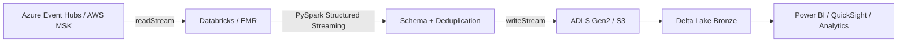
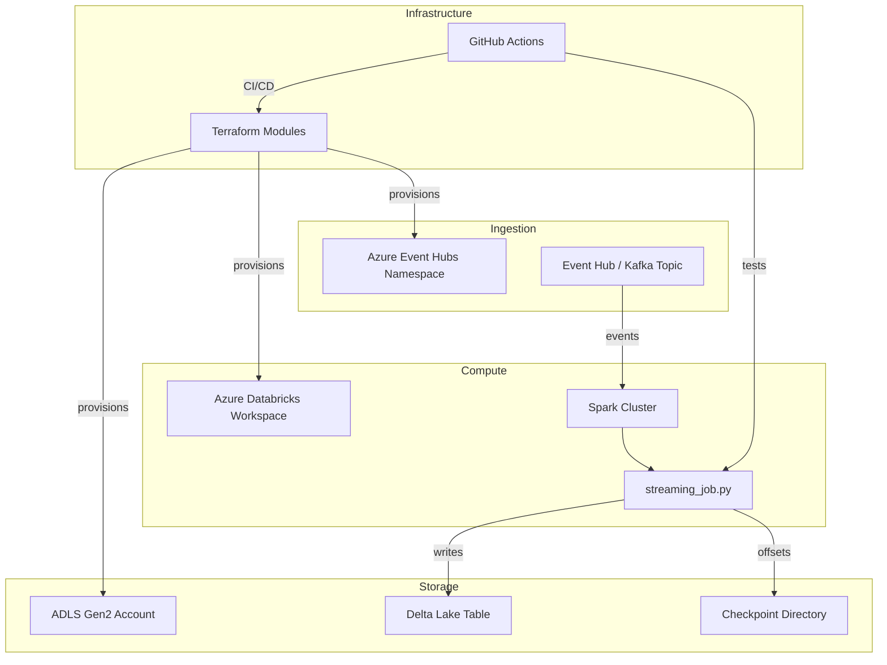

# Cloud-Native Streaming Data Platform — Architecture

## 1. High-Level Design

This project delivers a fully cloud-native, Infrastructure-as-Code (IaC) streaming data platform. It ingests events from a managed Kafka-compatible broker, processes them with PySpark Structured Streaming on a managed Spark runtime, and persists the results to a Delta Lake table backed by object storage.

---

## 2. Component Diagram

---

## 3. Data Flow

1. **Event Ingestion** — Producers publish JSON events to an Azure Event Hub or MSK topic.
2. **Stream Reading** — `streaming_job.py` uses `spark.readStream` with the Kafka connector (`kafka` library or Event Hubs connector).
3. **Validation & Enrichment** — Events are parsed, validated, and enriched with ingestion metadata (`ingested_at`, `partition`, `offset`).
4. **Deduplication** — A watermark on event time plus `dropDuplicates` removes replayed or rebalanced events.
5. **Persist to Delta** — The cleansed micro-batch is written to a Delta Lake bronze table in ADLS Gen2 / S3.
6. **Analytics / Downstream** — BI tools, notebooks, or ML pipelines read the bronze table and build silver/gold models.

---

## 4. Scalability Strategy

- **Ingestion:** Event Hub / MSK throughput scales by increasing partition count and throughput units / broker count.
- **Compute:** Databricks / EMR clusters scale vertically (worker size) and horizontally (worker count) based on backlog.
- **Storage:** ADLS Gen2 / S3 scale elastically. Delta Lake `OPTIMIZE` and `Z-ORDER` keep read performance predictable.
- **Terraform:** Resource SKUs are parameterized per environment, allowing dev to be small and prod to be sized for peak load.

---

## 5. Fault Tolerance

- **Checkpointing:** Spark Structured Streaming checkpoints offsets and state to ADLS Gen2 / S3.
- **Exactly-Once Delivery:** Kafka offset management + Delta Lake idempotent writes.
- **Idempotent Ingestion:** Natural keys or composite keys (`partition`, `offset`, `event_id`) prevent duplicate inserts on replay.
- **Managed Services:** Azure Event Hubs and Databricks abstract broker and cluster failover.

---

## 6. Failure Recovery

| Failure | Recovery |
|---|---|
| Spark driver crash | Restart the Databricks job; it resumes from the last checkpoint. |
| Event Hub throttling | Scale up throughput units or partition count; Spark backpressure reduces ingestion rate. |
| Bad event batch | Schema validation rejects corrupt rows. A dead-letter queue can be added for audit. |
| Terraform state lock | Use remote backend with state locking (Azure Storage + SAS / S3 + DynamoDB). |
| Region outage | Event Hub geo-disaster recovery or MSK multi-region replication; redeploy Terraform to a secondary region. |

---

## 7. Security Considerations

- **Encryption in transit:** TLS for Kafka/Event Hubs, HTTPS for ADLS/S3, TLS for Databricks control plane.
- **Encryption at rest:** ADLS/S3 server-side encryption and Delta Lake table-level ACLs.
- **Secrets:** Connection strings, SAS tokens, and service-principal credentials stored in Azure Key Vault / AWS Secrets Manager and injected via environment variables or Databricks secrets.
- **IAM:** Least-privilege roles for the Spark cluster (read Event Hubs, write storage) and Terraform service principal (Contributor on scoped resources).
- **Network:** Private endpoints and VNet integration for production deployments.

---

## 8. Deployment Model

| Environment | Resources |
|---|---|
| **dev** | Small Event Hub (1 TU), single-node Databricks job cluster, dev storage account. |
| **prod** | Auto-scaling Event Hub / MSK, multi-node Databricks cluster with auto-termination, production storage. |

### Deployment Steps
1. Configure Azure / AWS credentials and Terraform backend.
2. `terraform init && terraform plan -var-file=environments/dev/terraform.tfvars`
3. `terraform apply`
4. Set environment variables / Databricks secrets.
5. Run `src/streaming_job.py` as a Databricks job or EMR step.
6. GitHub Actions runs `terraform plan` on PRs and `terraform apply` on `main` (optional, protected).

---

## 9. Cost Considerations

- **Dev:** Use the smallest Event Hub tier, single-node Databricks, and lifecycle policies on dev storage.
- **Prod:** Use auto-scaling and auto-termination on Databricks; schedule jobs only when needed.
- **Storage:** Archive older partitions or use ADLS/S3 cool tier after 30+ days.
- **Monitoring:** Enable Azure Monitor / CloudWatch but configure retention to avoid runaway logging costs.
- **CI/CD:** GitHub Actions free tier is sufficient for Terraform plan and pytest; avoid long-running workflows.

---

## 10. Future Improvements

- Add Unity Catalog / AWS Glue Data Catalog integration for table governance.
- Implement automatic `OPTIMIZE` / `VACUUM` jobs for Delta Lake maintenance.
- Add Prometheus / Azure Monitor dashboards for throughput, latency, and error rate.
- Add a dead-letter queue and schema registry for robust event handling.
- Extend to multi-region active-active ingestion for higher availability.
