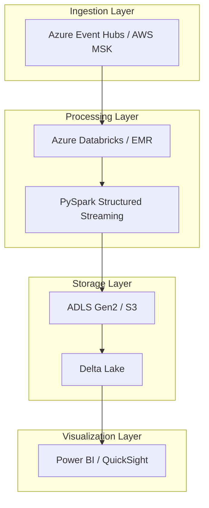

# Architecture

## Overview

This document describes the architecture of the Cloud-Native Streaming Data Platform.

## System Architecture

## Data Flow

1. **Ingestion** — Events are published to Azure Event Hubs / Amazon MSK
2. **Processing** — PySpark Structured Streaming reads from Event Hubs/MSK
3. **Transformation** — Schema enforcement, partitioning, deduplication
4. **Storage** — Delta Lake on ADLS Gen2 / S3 with exactly-once semantics
5. **Visualization** — Power BI / QuickSight for analytics

## Infrastructure Components

### Azure Stack
- **Azure Event Hubs** — Kafka-compatible event streaming
- **Azure Databricks** — Unified analytics platform
- **ADLS Gen2** — Scalable object storage
- **Azure Key Vault** — Secrets management
- **Azure Monitor** — Logging and monitoring

### AWS Stack
- **Amazon MSK** — Managed Kafka
- **Amazon EMR** — Managed Spark
- **Amazon S3** — Object storage
- **AWS Secrets Manager** — Secrets management
- **CloudWatch** — Logging and monitoring

## Security Considerations

- All data encrypted at rest and in transit
- IAM roles and policies for least privilege
- Secrets stored in Key Vault / Secrets Manager
- Network isolation with VPC / VNet

## Scalability

- Event Hubs/MSK scales automatically with partitions
- Databricks/EMR clusters can auto-scale
- ADLS Gen2/S3 provides virtually unlimited storage
- Delta Lake supports concurrent readers/writers

## Disaster Recovery

- Multi-region replication for Event Hubs/MSK
- Delta Lake time travel for data recovery
- Regular backups of stateful components
