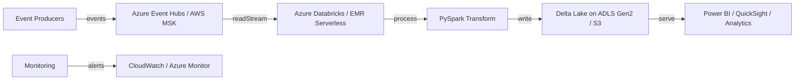

# Engineering Case Study — Cloud-Native Streaming Data Platform

---

## Problem

A streaming data platform needed to be moved from hand-provisioned resources to a repeatable, infrastructure-as-code foundation across Azure and AWS. The team needed multi-environment support, cost visibility, and production-grade monitoring without vendor lock-in.

## Challenges

- Infrastructure was provisioned manually, leading to environment drift and slow onboarding.
- There was no consistent CI/CD path from development to production.
- Monitoring and alerting were missing; failures were detected by downstream consumers.
- Cost controls were reactive rather than built into the design.
- The platform needed to support both Azure-native and AWS-native stacks for different clients.

## Architecture

## Implementation

- Terraform modules for `dev`, `staging`, and `prod` environments parameterized through `tfvars`.
- Azure Event Hubs and AWS MSK used as ingestion backbones depending on cloud target.
- Databricks and EMR Serverless used for Spark processing with shared job code.
- Delta Lake on ADLS Gen2 and S3 for the lakehouse storage layer.
- CloudWatch and Azure Monitor dashboards with failure and lag alarms.

## Testing Strategy

- `terraform validate` and `terraform plan` run on every PR.
- Integration tests submit sample events and verify Delta output in a sandbox environment.
- `pytest` for PySpark transform logic with in-memory fixtures.
- Cost estimates reviewed before any `apply` to production.

## Scalability

- Terraform modules scale by increasing Kafka partitions, Spark executors, and storage account throughput.
- Multi-environment approach isolates load and blast radius.
- Delta Lake `OPTIMIZE` and `VACUUM` jobs scheduled to manage file growth.

## Deployment Strategy

- `dev` uses public subnets and minimal MSK/Event Hubs capacity for fast iteration.
- `staging` mirrors production in a separate account/subscription.
- `prod` uses private subnets, NAT gateways, and full monitoring.
- CI/CD runs `terraform plan` on PRs and `apply` on manual approval for production.

## Tradeoffs

| Decision | Pros | Cons |
|---|---|---|
| Terraform over manual setup | Repeatable, version-controlled, auditable | Initial learning curve and state management |
| MSK Serverless / Event Hubs | Managed, scalable, IAM/Entra auth | Higher per-message cost at low scale |
| Delta Lake on cloud storage | Separation of compute and storage | Network latency, egress cost |
| Dual Azure + AWS | Flexibility for clients | More modules to maintain, no single source of truth |

## Results

- Infrastructure provisioning reduced from hours to minutes.
- Multi-environment parity prevents "works on my machine" issues.
- Monitoring and alerting catch failures before downstream consumers are impacted.
- Cost estimates and budgets are defined before resources are deployed.

## Business Value

- Faster client onboarding because environments are reproducible.
- Lower operational risk through version-controlled infrastructure and automated testing.
- Cloud cost predictability through sizing guides and budget alerts.
- Platform can serve multiple clients with different cloud preferences.

## Recruiter Takeaways

- Designed and deployed a multi-cloud streaming data platform with Terraform.
- Demonstrated infrastructure-as-code, CI/CD, and production monitoring.
- Balanced cost, scalability, and operational concerns across Azure and AWS.
- Proved architecture and system design thinking with documented tradeoffs.
