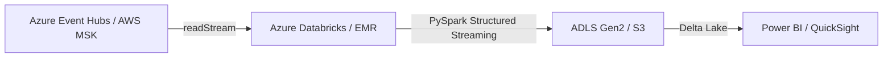

# Cloud-Native Streaming Data Platform

A production-ready streaming data platform built on Azure/AWS with Terraform, demonstrating Cloud Data Engineer and Data Platform Engineer capabilities.

## Architecture



## Tech Stack

- **Azure / AWS** — Cloud infrastructure
- **Azure Event Hubs / Amazon MSK** — Kafka-compatible event streaming
- **Azure Databricks / Amazon EMR** — Unified analytics platform
- **ADLS Gen2 / Amazon S3** — Scalable object storage
- **Delta Lake** — ACID transactions on data lake
- **Terraform** — Infrastructure as Code
- **GitHub Actions** — CI/CD

## Project Structure

```
cloud-data-platform/
├── terraform/
│   ├── main.tf
│   ├── variables.tf
│   ├── outputs.tf
│   ├── modules/
│   │   ├── event_hub/
│   │   ├── databricks/
│   │   └── storage/
│   └── environments/
│       ├── dev/
│       └── prod/
├── src/
│   ├── streaming_job.py
│   ├── config.py
│   └── utils.py
├── notebooks/
│   ├── 01_setup_tables.py
│   └── 02_validate_data.py
├── tests/
│   ├── test_streaming_job.py
│   └── test_config.py
├── .github/workflows/
│   ├── terraform-plan.yml
│   └── terraform-apply.yml
├── README.md
└── ARCHITECTURE.md
```

## Quickstart

### Prerequisites
- Azure subscription with Contributor access
- Terraform 1.5.0 or higher
- Azure CLI installed and configured
- Python 3.10 or higher (for streaming job)
- Databricks account (optional, for production deployment)

### 1. Clone the repository

```bash
git clone https://github.com/Sasireddy001/Cloud-data-platform.git
cd Cloud-data-platform
```

### 2. Configure Terraform

```bash
cd terraform
terraform init
terraform plan -var-file=environments/dev/terraform.tfvars
terraform apply -var-file=environments/dev/terraform.tfvars
```

### 3. Get infrastructure outputs

```bash
terraform output
```

### 4. Configure environment variables

```bash
export EVENT_HUB_NAMESPACE_NAME=$(terraform output -raw event_hub_namespace_name)
export EVENT_HUB_NAME=$(terraform output -raw event_hub_name)
export EVENT_HUB_CONNECTION_STRING=$(terraform output -raw event_hub_connection_string)
export DELTA_PATH=$(terraform output -raw delta_path)
export CHECKPOINT_PATH=$(terraform output -raw checkpoint_path)
export DATABRICKS_HOST=$(terraform output -raw databricks_host)
```

### 5. Run the streaming job

```bash
cd ..
python src/streaming_job.py
```

### Databricks Deployment

```bash
# 1. Create a Databricks workspace (or use existing)
# 2. Create a cluster
# 3. Upload src/ directory to Databricks
# 4. Create a job in Databricks to run streaming_job.py
# 5. Configure job with environment variables from Terraform outputs
```

## Features

- **Infrastructure as Code** — All infrastructure defined in Terraform
- **Streaming pipeline** — PySpark Structured Streaming with Delta Lake
- **Data quality** — Validation with Great Expectations/Pandera
- **CI/CD** — Automated Terraform deployments via GitHub Actions
- **Multi-environment** — Dev and prod configurations

## Author

- **Sasidhar Mopuru** — Data & AI Platform Engineer
- [GitHub](https://github.com/Sasireddy001)
- [Portfolio](https://sasireddy001.github.io/Portfolio)
- [LinkedIn](https://www.linkedin.com/in/sasidhar-mopuru-417a03233)
- Email: sasidharmopuru@gmail.com

**Certifications:**
- DP-700: Implementing Data Engineering Solutions using Microsoft Fabric – Microsoft
- Databricks Certified Data Engineer Associate – Databricks

## License

This project is licensed under the [MIT License](LICENSE).
