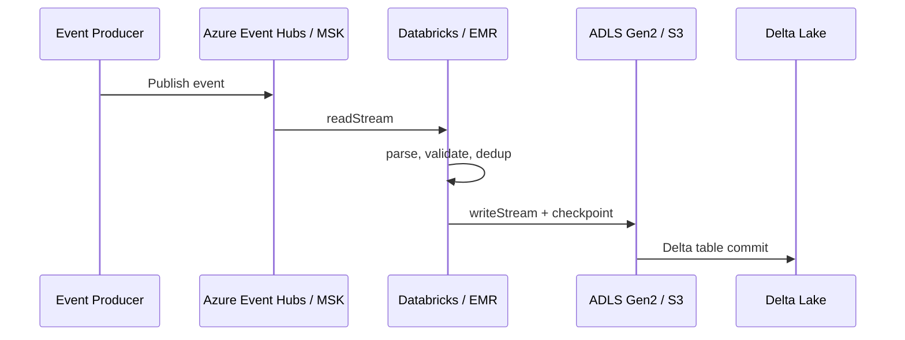

# Cloud-Native Streaming Data Platform — System Design

## 1. Requirements

### Functional Requirements
1. Deploy a cloud-native streaming data platform using Infrastructure as Code (IaC).
2. Ingest events from a Kafka-compatible event broker (Azure Event Hubs / AWS MSK).
3. Process events with PySpark Structured Streaming on a managed Spark runtime (Azure Databricks / EMR).
4. Persist cleansed, deduplicated data to an object storage-backed Delta Lake table.
5. Provide CI/CD pipelines for Terraform and application code.
6. Support multiple environments (dev, prod) with identical configuration.

### Non-Functional Requirements
- **Scalability:** Scale from 1,000 to 100,000+ events/min by adding partitions and workers.
- **Availability:** 99.9% event ingestion availability.
- **Reliability:** Exactly-once delivery, checkpointing, and replay capability.
- **Cost Efficiency:** Use managed services and on-demand/spot pricing where possible.
- **Security:** Encrypted in transit and at rest; secrets stored in a vault service.
- **Maintainability:** All infrastructure and code changes are version-controlled and peer-reviewed.

---

## 2. Functional Design

### Modules
- `terraform/` — multi-environment modules for Event Hubs / MSK, storage, Databricks / EMR, IAM.
- `src/streaming_job.py` — Spark Structured Streaming application.
- `src/config.py` — environment-driven configuration.
- `notebooks/` — setup, validation, and ops notebooks.
- `tests/` — unit and integration tests for config and streaming logic.
- `.github/workflows/` — Terraform plan/apply and app CI.

---

## 3. Scalability

- **Ingestion Layer:** Azure Event Hubs partitions or MSK broker count scale horizontally with throughput.
- **Compute Layer:** Databricks / EMR clusters auto-scale based on streaming backlog.
- **Storage Layer:** ADLS Gen2 / S3 are virtually unlimited; Delta Lake supports concurrent reads and writes.
- **Network:** Keep streaming, compute, and storage in the same region and VNet to minimize latency and egress.

---

## 4. Availability

| Component | Strategy |
|---|---|
| Event Hub / MSK | Built-in replication and geo-disaster recovery options. |
| Databricks / EMR | Multi-node cluster with auto-restart and checkpoint recovery. |
| ADLS Gen2 / S3 | LRS / ZRS / S3 standard for durability; SLA-backed availability. |
| Streaming job | Spark Structured Streaming resumes from checkpoints on driver restart. |

---

## 5. Reliability

- **Exactly-Once:** Kafka offset checkpointing + Delta Lake idempotent `merge` / `append` writes.
- **Data Quality:** Schema validation and row-level validation before write.
- **Observability:** Cloud-native metrics and logging (Azure Monitor / CloudWatch) should be wired to the job.
- **Recovery:** Terraform state stored remotely with locking; application state in checkpoints; data in object storage.

---

## 6. Security

- All storage and transport encryption enabled by default.
- Secrets (connection strings, API keys) stored in Azure Key Vault / AWS Secrets Manager.
- Service principals and IAM roles follow least privilege.
- Network isolation via VNet / VPC and private endpoints where applicable.
- Terraform state files stored in a secure backend (Azure Storage with SAS or S3 with SSE).

---

## 7. Tradeoffs

| Decision | Pros | Cons |
|---|---|---|
| **Terraform vs Pulumi / CDK** | Widely understood, stateful, multi-cloud | Slower feedback loop, state management overhead |
| **Azure Event Hubs vs Kafka on VMs** | Fully managed, auto-scaling | Vendor lock-in, higher cost at very high scale |
| **Databricks vs EMR** | Tight Delta Lake / Unity Catalog integration | Premium cost; Azure-centric path |
| **Delta Lake vs raw Parquet** | ACID, time travel, efficient upserts | Adds compute overhead for small workloads |
| **GitHub Actions for Terraform** | Consistent, reviewable | Need remote state and secrets before first apply |

---

## 8. Design Decisions

1. **IaC First** — All Azure / AWS resources are declared in Terraform so the platform is reproducible and peer-reviewable.
2. **Multi-Environment Modules** — `terraform/environments/dev` and `terraform/environments/prod` share root modules, reducing drift.
3. **Separation of Ingestion, Compute, and Storage** — Each layer can be scaled, updated, and secured independently.
4. **Configuration via Environment Variables** — The streaming job is portable across dev, Databricks, and CI.
5. **CI/CD for Both Infra and Code** — `terraform-plan.yml` protects against accidental infrastructure changes; app CI runs tests on every commit.
